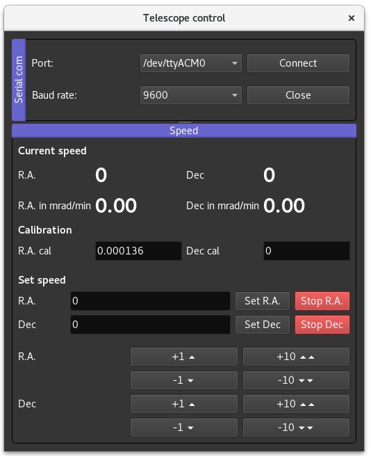

# telescope_control
Telescope's mount remote control using Python 3, Arduino framework, a bunch of electronics and 3d printed parts.

This project aims to controls the Right Ascension (R.A.) and Declination (DEC) axis of an *equatorial mount*. However, it can be easily adapted to any other type of mount. For controlling the focus of the optical tube see this [repository](https://github.com/marianobarella/dc_motor_controller) and this link [Focuser 3d printed parts](https://www.thingiverse.com/thing:4636227).

### What kind of telescope/mount?
The project is based on a low-cost Celestron PowerSeeker 127EQ Newtonian telescope (to be precise, it's a Bird-Jones telescope). **Bonus:** this project works for all PowerSeeker XXXEQ reflective telescope as they all share the same equatorial mount.

### How does this work?
Gears and motors responsible for the movements of the axis are added to the mount. All parts work as an accesory to the original mount, meaning that you won't modify the original design/structure of the telescope mount.

### What you need:
- An Arduino Uno/Mega board
- A motor shield based on the L293N IC
- 2 DC motors, check if max torque fulfill your requirements (mind the weight of your telescope, its counterweight, the camera, etc.)
- 12 V DC power supply
- Connectors you may like to perform the electrical connections
- A PC with Python 3 with Serial, Pyt5, pyqtgraph libraries and Arduino IDE software with MotorDriver library (see ra_and_dec_control.ino for further details)
- Access to a 3D printer to fabricate the electronics' case and, in case you have a the equatorial mount mentioned above it would be necessary to print all clamps, gears and motor cases.

### How to use:
- `ra_and_dec_control.ino` should be uploaded to the Arduino board via the Arduino IDE.
- `telescope_gui.py` can be executed from the terminal/cmd prompt, Spyder or the environment you use.
- `ArduinoCommunication.py` should be placed in the same folder as `telescope_gui.py`.

### Graphical User Interface

- There's a dock for the serial com and another for axis speed.
- R.A. and Dec speeds are set using a byte-type variable as the motor speed is controlled via an Arduino's PWM signal. This means that their values range from 0 to 255. You can choose between clockwise (positive speeds) or anti-clockwise (negative) rotational speeds.
- Max and min speed for the axis is set to +255 and -255, respectively. Using the 3d printed parts located at the `3d_printed_parts` folder, the R.A. axis can reach 35 mrad/min. This speed exceeds Earth's rotational speed by a factor of 8, giving you a margin to track other objects.
- After assembly, you can measure the actual speed using a laser pointer mounted on the motorized mount aimed at a distant wall. Estimate the rotational speed for each axis and use a conversion coefficient (at calibration box) to transform byte units into millirad per minute.

### 3d printed parts
All parts were designed with FreeCAD and converted to gcode using Slic3er (both free and open-source programs). Inside `3d_printed_parts` folder you will find the .fcstd files (FreeCAD format) and .stl files for all parts you need: gears, clamps and strctures to grab the mount, and the motor cases. Check last versions, upgrades may happen.

#### Picture of the setup:

Comments: tested on Debian 9.13 and Windows 7 Home, Python 3.5.3, Arduno IDE 1.8.10. 

#### Disclaimer:
All 3d parts are functional and, you may think they lack of aesthetics... You're right! If new designs improve the way the accesories looks like, please share!
